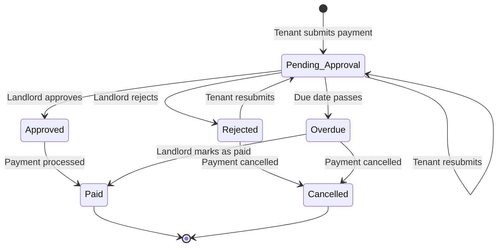

# Payment Approval Workflow Implementation Plan

## Executive Summary

This plan outlines the implementation of a comprehensive payment approval workflow for the RentalBiz platform. The system will enable landlords to validate and approve payment records submitted by tenants before they are considered official. The implementation includes complete audit logging, notification systems, and role-based dashboards.

## Current System Analysis

### Existing Components
- **Payment Model**: Supports rental, electricity, water, gas, deposit, maintenance, and other payment types
- **Notification System**: Handles payment reminders and overdue alerts
- **Role-based Access**: Distinguishes between landlords and tenants
- **Dashboard**: Provides basic statistics and pending payment views

### Identified Gaps
1. No payment approval workflow (payments can be marked as paid directly)
2. Missing audit trail for payment actions
3. No utility service registration beyond payment types
4. Limited reporting capabilities
5. No payment deletion mechanism

---

## Architecture Design

### Payment Status Flow



### Data Models Required

#### 1. PaymentApproval Model
Tracks the approval lifecycle for each payment submission.

| Field | Type | Description |
|-------|------|-------------|
| id | UUID | Primary key |
| payment_id | UUID | Foreign key to payments |
| submitted_by | UUID | User who submitted |
| submitted_at | DATETIME | Submission timestamp |
| status | ENUM | pending, approved, rejected, resubmitted |
| approved_by | UUID | Landlord who approved |
| approved_at | DATETIME | Approval timestamp |
| rejection_reason | TEXT | Reason for rejection |
| notes | TEXT | Internal notes |
| metadata | JSON | Additional data |

#### 2. AuditLog Model
Comprehensive audit trail for all payment-related actions.

| Field | Type | Description |
|-------|------|-------------|
| id | UUID | Primary key |
| entity_type | STRING | Type of entity (payment, contract, etc.) |
| entity_id | UUID | ID of the entity |
| action | STRING | Action performed |
| user_id | UUID | User who performed action |
| old_values | JSON | Previous values |
| new_values | JSON | New values |
| ip_address | STRING | Client IP |
| user_agent | STRING | Browser/client info |
| created_at | DATETIME | Timestamp |

---

## Implementation Steps

### Phase 1: Database Models (Days 1-2)

#### Step 1.1: Create PaymentApproval Model
**File**: `backend/models/PaymentApproval.js`

```javascript
module.exports = (sequelize, DataTypes) => {
  const PaymentApproval = sequelize.define('PaymentApproval', {
    id: { type: DataTypes.UUID, primaryKey: true, defaultValue: DataTypes.UUIDV4 },
    payment_id: { type: DataTypes.UUID, allowNull: false, references: { model: 'payments', key: 'id' } },
    submitted_by: { type: DataTypes.UUID, allowNull: false, references: { model: 'users', key: 'id' } },
    status: { type: DataTypes.ENUM('pending', 'approved', 'rejected', 'resubmitted'), defaultValue: 'pending' },
    approved_by: { type: DataTypes.UUID, references: { model: 'users', key: 'id' } },
    approved_at: { type: DataTypes.DATE },
    rejection_reason: { type: DataTypes.TEXT },
    notes: { type: DataTypes.TEXT },
    metadata: { type: DataTypes.JSON }
  });
  
  return PaymentApproval;
};
```

#### Step 1.2: Create AuditLog Model
**File**: `backend/models/AuditLog.js`

```javascript
module.exports = (sequelize, DataTypes) => {
  const AuditLog = sequelize.define('AuditLog', {
    id: { type: DataTypes.UUID, primaryKey: true, defaultValue: DataTypes.UUIDV4 },
    entity_type: { type: DataTypes.STRING(50), allowNull: false },
    entity_id: { type: DataTypes.UUID, allowNull: false },
    action: { type: DataTypes.STRING(50), allowNull: false },
    user_id: { type: DataTypes.UUID, allowNull: false },
    old_values: { type: DataTypes.JSON },
    new_values: { type: DataTypes.JSON },
    ip_address: { type: DataTypes.STRING(45) },
    user_agent: { type: DataTypes.TEXT }
  });
  
  return AuditLog;
};
```

#### Step 1.3: Update Payment Model
**File**: `backend/models/Payment.js`

Add new fields:
```javascript
status: {
  type: DataTypes.ENUM('pending', 'pending_approval', 'approved', 'paid', 'overdue', 'rejected', 'cancelled', 'partial'),
  allowNull: false,
  defaultValue: 'pending'
},
requires_approval: {
  type: DataTypes.BOOLEAN,
  defaultValue: true
},
submitted_at: { type: DataTypes.DATE },
approved_at: { type: DataTypes.DATE },
rejected_at: { type: DataTypes.DATE },
rejection_reason: { type: DataTypes.TEXT }
```

#### Step 1.4: Create Database Migration
**File**: `backend/migrations/create_approval_workflow.js`

---

### Phase 2: Backend API Implementation (Days 3-5)

#### Step 2.1: PaymentApproval Controller
**File**: `backend/controllers/paymentApprovalController.js`

Key endpoints:
- `POST /api/payments/:id/submit` - Submit payment for approval
- `PUT /api/payments/:id/approve` - Approve payment
- `PUT /api/payments/:id/reject` - Reject payment
- `GET /api/payments/pending-approvals` - Get pending approvals (landlord only)
- `GET /api/payments/my-submissions` - Get user's submission history

#### Step 2.2: AuditLog Controller
**File**: `backend/controllers/auditLogController.js`

Key endpoints:
- `GET /api/audit-logs` - Get audit logs (filtered by entity)
- `GET /api/audit-logs/payment/:id` - Get payment history
- `GET /api/audit-logs/export` - Export audit logs

#### Step 2.3: Update Routes
**File**: `backend/routes/paymentRoutes.js`

Add new routes and update existing ones to integrate approval workflow.

#### Step 2.4: Create Audit Middleware
**File**: `backend/middleware/auditLogger.js`

Auto-log payment actions to audit trail.

---

### Phase 3: Notification System (Days 6-7)

#### Step 3.1: Update Notification Types
Add new notification types:
- `payment_submitted` - Tenant submitted payment
- `payment_approved` - Landlord approved payment
- `payment_rejected` - Landlord rejected payment
- `approval_required` - Payment needs landlord attention

#### Step 3.2: Create Notification Service
**File**: `backend/services/approvalNotificationService.js`

Functions:
- `notifyLandlordOfNewPayment(payment)` - Send notification when tenant submits payment
- `notifyTenantOfApproval(payment)` - Confirm payment approval
- `notifyTenantOfRejection(payment, reason)` - Inform about rejection

#### Step 3.3: Update Email Templates
**File**: `backend/services/emailService.js`

Add email templates for:
- Payment submission confirmation
- Payment approval notification
- Payment rejection notification

---

### Phase 4: Frontend Implementation (Days 8-12)

#### Step 4.1: Approval Dashboard (Landlord)
**File**: `frontend/src/pages/Payments/ApprovalDashboard.jsx`

Components:
- Pending approvals list with filtering
- Quick approve/reject actions
- Payment details view modal
- Submission history

#### Step 4.2: Tenant Submission Interface
**File**: `frontend/src/pages/Payments/PaymentForm.jsx`

Updates:
- Submit payment for approval flow
- View submission status
- See approval/rejection feedback
- Resubmit rejected payments

#### Step 4.3: Audit Log Viewer
**File**: `frontend/src/pages/Payments/AuditLogs.jsx`

Features:
- View payment history
- Filter by action type
- Export functionality
- Compare old vs new values

#### Step 4.4: Update Payment Service
**File**: `frontend/src/services/api.js`

Add new API methods:
```javascript
export const paymentApprovalService = {
  submit: (id, data) => api.put(`/payments/${id}/submit`, data),
  approve: (id, data) => api.put(`/payments/${id}/approve`, data),
  reject: (id, reason) => api.put(`/payments/${id}/reject`, { rejection_reason: reason }),
  getPending: () => api.get('/payments/pending-approvals'),
  getMySubmissions: () => api.get('/payments/my-submissions')
};

export const auditLogService = {
  getPaymentLogs: (paymentId) => api.get(`/audit-logs/payment/${paymentId}`),
  export: (params) => api.get('/audit-logs/export', { params })
};
```

---

### Phase 5: Reports and Analytics (Days 13-15)

#### Step 5.1: Payment Reports API
**File**: `backend/controllers/reportController.js`

Reports:
- Monthly payment summary by property
- Approval turnaround times
- Payment collection rates
- Overdue payment analysis

#### Step 5.2: Frontend Reports Page
**File**: `frontend/src/pages/Reports/PaymentReports.jsx`

Features:
- Configurable date ranges
- Property filtering
- Export to CSV/PDF
- Visual charts

---

### Phase 6: Testing and Documentation (Days 16-18)

#### Step 6.1: Unit Tests
- Payment approval workflow tests
- Audit logging verification
- Notification delivery tests

#### Step 6.2: Integration Tests
- Complete approval flow testing
- Role-based access verification
- Error handling scenarios

#### Step 6.3: API Documentation
- Update API documentation
- Add workflow diagrams
- Create user guides

---

## File Structure

```
backend/
├── controllers/
│   ├── paymentApprovalController.js  [NEW]
│   ├── paymentController.js          [UPDATED]
│   └── auditLogController.js         [NEW]
├── models/
│   ├── Payment.js                    [UPDATED]
│   ├── PaymentApproval.js           [NEW]
│   └── AuditLog.js                  [NEW]
├── migrations/
│   └── create_approval_workflow.js  [NEW]
├── middleware/
│   └── auditLogger.js               [NEW]
├── routes/
│   └── paymentRoutes.js             [UPDATED]
├── services/
│   ├── approvalNotificationService.js [NEW]
│   └── emailService.js               [UPDATED]
└── tests/
    ├── paymentApproval.test.js      [NEW]
    └── auditLog.test.js             [NEW]

frontend/src/
├── pages/
│   ├── Payments/
│   │   ├── ApprovalDashboard.jsx    [NEW]
│   │   ├── PaymentForm.jsx          [UPDATED]
│   │   ├── AuditLogs.jsx            [NEW]
│   │   └── PaymentDetail.jsx        [UPDATED]
│   └── Reports/
│       └── PaymentReports.jsx       [NEW]
└── services/
    └── api.js                        [UPDATED]
```

---

## Approval Workflow Details

### Tenant Submission Flow
1. Tenant creates payment record via `/api/payments`
2. Payment status set to `pending_approval`
3. Notification sent to landlord
4. Tenant sees "Pending Approval" status

### Landlord Review Flow
1. Landlord receives notification
2. Landlord views pending approvals via dashboard
3. Landlord reviews payment details
4. Landlord takes action:
   - **Approve**: Payment status changes to `approved`, notification sent to tenant
   - **Reject**: Payment status changes to `rejected`, rejection reason recorded, tenant notified
   - **Request Info**: Sends note to tenant, status remains pending

### Audit Trail Events
- Payment created
- Payment submitted for approval
- Payment approved
- Payment rejected
- Payment marked as paid
- Payment updated
- Payment deleted

---

## Security Considerations

1. **Authorization**: Only landlords can approve/reject payments
2. **Validation**: All submissions validated before processing
3. **Audit Trail**: All actions logged with user identification
4. **Notifications**: Role-based notification delivery
5. **Data Integrity**: No deletions from approved payments (only cancellations)

---

## Timeline

| Phase | Duration | Deliverables |
|-------|----------|-------------|
| Phase 1: Database Models | 2 days | New models, migrations |
| Phase 2: Backend API | 3 days | Controllers, routes, middleware |
| Phase 3: Notifications | 2 days | Email and system notifications |
| Phase 4: Frontend | 5 days | Approval dashboard, forms |
| Phase 5: Reports | 3 days | Reports and analytics |
| Phase 6: Testing | 3 days | Tests, docs |
| **Total** | **18 days** | Complete approval workflow |

---

## Rollout Strategy

### 1. Database Migration
```sql
-- New tables
CREATE TABLE payment_approvals (...);
CREATE TABLE audit_logs (...);

-- Updated payments table
ALTER TABLE payments ADD COLUMN status ENUM('pending', 'pending_approval', 'approved', 'paid', 'overdue', 'rejected', 'cancelled', 'partial') DEFAULT 'pending';
ALTER TABLE payments ADD COLUMN requires_approval BOOLEAN DEFAULT TRUE;
```

### 2. Feature Flags
Enable approval workflow via environment variable:
```env
PAYMENT_APPROVAL_WORKFLOW_ENABLED=true
```

### 3. User Communication
- In-app notifications
- Email announcements
- Updated user documentation

---

## Success Metrics

1. **Approval Rate**: Percentage of payments approved vs rejected
2. **Processing Time**: Average time from submission to approval
3. **User Adoption**: Percentage of users using new workflow
4. **Error Rate**: Failed submission attempts
5. **Notification Delivery**: Successful notification rate

---

## Next Steps

1. Review and approve this plan
2. Begin Phase 1: Database Models implementation
3. Set up development environment
4. Create initial migration scripts
5. Implement PaymentApproval model
6. Continue with subsequent phases

---

**Plan Version**: 1.0
**Last Updated**: 2026-02-03
**Status**: Ready for Review
