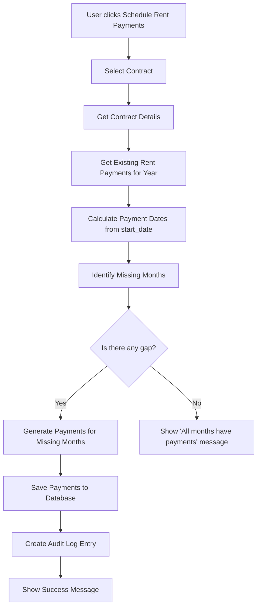
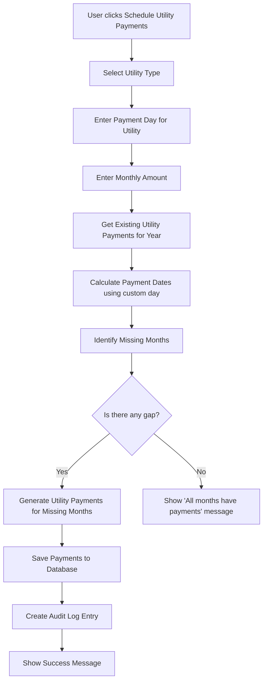

# Payment Scheduling System - Implementation Plan

## Overview

Design and implement a comprehensive payment scheduling system for rental properties that manages both rent and utility payments over a one-year period. The system should automatically generate monthly payments while respecting existing records and avoiding duplicates.

## Requirements Analysis

### Core Features

1. **Scheduling Button** - Generates monthly payments automatically for the current year
2. **Gap-Filling Logic** - Skips months with existing payments, fills missing months
3. **Lease Start Date Integration** - Uses contract's `start_date` for rent payment calculations
4. **Utility Payment Scheduling** - Allows specifying custom payment dates for utilities

### Payment Types Supported

- **Rent Payments** - Based on lease start date + payment_day from contract
- **Utility Payments** - Electricity, Water, Gas with custom payment dates

## System Architecture

### Backend Components

#### 1. New Service: `backend/services/paymentSchedulerService.js`

```javascript
// Key methods:
- scheduleRentPayments(contractId, year) - Generate rent payments for a year
- scheduleUtilityPayments(contractId, utilityType, paymentDay, amount, year) - Generate utility payments
- getExistingPaymentsForYear(contractId, type, year) - Get payments already scheduled
- fillPaymentGaps(payments, year, startDate, paymentDay) - Fill missing months
- generatePaymentSchedule(startDate, months, paymentDay, amount, type, contractId, userId) - Generic scheduler
```

#### 2. New Controller: `backend/controllers/paymentSchedulerController.js`

```javascript
// Endpoints:
- POST /api/payments/schedule/rent - Schedule rent payments for a contract
- POST /api/payments/schedule/utility - Schedule utility payments
- GET /api/payments/schedule/status/:contractId - Get scheduling status for a contract
- POST /api/payments/schedule/fill-gaps - Fill missing payment months
```

#### 3. Updated Routes: `backend/routes/paymentRoutes.js`

Add new scheduling endpoints.

### Frontend Components

#### 1. New Component: `frontend/src/pages/Payments/PaymentScheduler.jsx`

```
Features:
- Schedule Rent Payments section
- Schedule Utility Payments section
- Gap-filling option
- Year selector (default: current year)
- Preview of payments to be created
- Progress indicator
```

#### 2. Updated PaymentsList.jsx

Add "Schedule Payments" button and link to scheduler page.

## Database Schema Updates

### Payment Model Extensions (Optional)

No major schema changes needed - existing `is_automatic` field can be used to mark scheduled payments.

## Workflow Diagrams

### Rent Payment Scheduling Flow



### Utility Payment Scheduling Flow



## Implementation Steps

### Step 1: Create Payment Scheduler Service

File: `backend/services/paymentSchedulerService.js`

**Key Logic:**

```javascript
class PaymentSchedulerService {
  /**
   * Generate rent payment dates based on contract start_date
   * @param {Date} startDate - Contract start date
   * @param {number} year - Target year
   * @param {number} paymentDay - Day of month for payment
   * @returns {Array} Array of payment dates
   */
  generateRentPaymentDates(startDate, year, paymentDay) {
    const dates = [];
    const start = new Date(startDate);
    
    // Determine lease start month and year
    const leaseStartMonth = start.getMonth();
    const leaseStartYear = start.getFullYear();
    
    // Generate dates from lease start month to December of target year
    for (let month = leaseStartMonth; month < 12; month++) {
      const paymentDate = new Date(year, month, paymentDay);
      
      // Only create if date is >= lease start date
      if (paymentDate >= start) {
        dates.push(paymentDate.toISOString().split('T')[0]);
      }
    }
    
    return dates;
  }
  
  /**
   * Generate utility payment dates with custom payment day
   * @param {number} year - Target year
   * @param {number} paymentDay - Day of month for utility payment
   * @returns {Array} Array of payment dates for all 12 months
   */
  generateUtilityPaymentDates(year, paymentDay) {
    const dates = [];
    
    for (let month = 0; month < 12; month++) {
      // Handle months with fewer days (e.g., February)
      const maxDay = new Date(year, month + 1, 0).getDate();
      const day = Math.min(paymentDay, maxDay);
      const paymentDate = new Date(year, month, day);
      
      dates.push(paymentDate.toISOString().split('T')[0]);
    }
    
    return dates;
  }
  
  /**
   * Fill gaps in payment schedule - skip existing months
   * @param {Array} existingPayments - Existing payment records
   * @param {Array} candidateDates - Potential payment dates
   * @returns {Array} Dates to actually create
   */
  calculateMissingPaymentDates(existingPayments, candidateDates) {
    const existingMonths = new Set(
      existingPayments.map(p => {
        const date = new Date(p.due_date);
        return `${date.getFullYear()}-${String(date.getMonth() + 1).padStart(2, '0')}`;
      })
    );
    
    return candidateDates.filter(dateStr => {
      const date = new Date(dateStr);
      const monthKey = `${date.getFullYear()}-${String(date.getMonth() + 1).padStart(2, '0')}`;
      return !existingMonths.has(monthKey);
    });
  }
}
```

### Step 2: Create Payment Scheduler Controller

File: `backend/controllers/paymentSchedulerController.js`

**Endpoints:**

```javascript
// POST /api/payments/schedule/rent
// Body: { contractId, year, paymentDay }
// Response: { success, data: { scheduled: count, skipped: count, payments: [] } }

// POST /api/payments/schedule/utility
// Body: { contractId, utilityType, paymentDay, amount, year }
// Response: { success, data: { scheduled: count, skipped: count, payments: [] } }

// GET /api/payments/schedule/status/:contractId
// Response: { success, data: { rent: { scheduled: [], missing: [] }, utilities: {} } }
```

### Step 3: Add API Routes

File: `backend/routes/paymentRoutes.js`

```javascript
const router = require('express').Router();
const paymentSchedulerController = require('../controllers/paymentSchedulerController');
const { authenticate, authorize } = require('../middleware/auth');

// Schedule rent payments
router.post('/schedule/rent', authenticate, authorize('landlord'), paymentSchedulerController.scheduleRentPayments);

// Schedule utility payments
router.post('/schedule/utility', authenticate, authorize('landlord'), paymentSchedulerController.scheduleUtilityPayments);

// Get scheduling status
router.get('/schedule/status/:contractId', authenticate, paymentSchedulerController.getScheduleStatus);

module.exports = router;
```

### Step 4: Create Frontend Scheduler Component

File: `frontend/src/pages/Payments/PaymentScheduler.jsx`

**UI Sections:**

```jsx
// Section 1: Rent Payment Scheduling
<Card>
  <Title>Programar Pagos de Renta</Title>
  <SelectContract onSelect={handleContractSelect} />
  <YearSelector value={rentYear} onChange={setRentYear} />
  <PaymentDayInput value={rentPaymentDay} onChange={setRentPaymentDay} />
  <Button onClick={scheduleRentPayments} disabled={!selectedContract}>
    Programar Pagos de Renta
  </Button>
  <PreviewTable payments={rentPreview} />
</Card>

// Section 2: Utility Payment Scheduling
<Card>
  <Title>Programar Servicios Públicos</Title>
  <UtilityTypeSelector value={utilityType} onChange={setUtilityType} />
  <PaymentDayInput value={utilityPaymentDay} onChange={setUtilityPaymentDay} />
  <AmountInput value={utilityAmount} onChange={setUtilityAmount} />
  <YearSelector value={utilityYear} onChange={setUtilityYear} />
  <Button onClick={scheduleUtilityPayments} disabled={!selectedContract}>
    Programar Pagos de Servicios
  </Button>
  <PreviewTable payments={utilityPreview} />
</Card>
```

### Step 5: Add Scheduling Button to Payments List

File: `frontend/src/pages/Payments/PaymentsList.jsx`

```jsx
<div className="flex items-center justify-between">
  <div>
    <h1 className="text-2xl font-bold text-gray-900">Pagos</h1>
    <p className="text-gray-500">Historial y seguimiento de pagos</p>
  </div>
  <div className="flex space-x-3">
    {isLandlord && (
      <>
        <Link to="/payments/schedule" className="btn btn-secondary">
          Programar Pagos
        </Link>
        <button
          onClick={() => setShowForm(true)}
          className="btn btn-primary"
        >
          Crear Pago
        </button>
      </>
    )}
  </div>
</div>
```

## API Integration

### Frontend Service: `frontend/src/services/paymentSchedulerService.js`

```javascript
import api from './api';

export const paymentSchedulerService = {
  async scheduleRentPayments(data) {
    const response = await api.post('/payments/schedule/rent', data);
    return response.data;
  },
  
  async scheduleUtilityPayments(data) {
    const response = await api.post('/payments/schedule/utility', data);
    return response.data;
  },
  
  async getScheduleStatus(contractId) {
    const response = await api.get(`/payments/schedule/status/${contractId}`);
    return response.data;
  },
  
  async fillGaps(data) {
    const response = await api.post('/payments/schedule/fill-gaps', data);
    return response.data;
  }
};
```

## Error Handling

### Backend Validation

1. **Contract Validation**
   - Verify contract exists and belongs to landlord
   - Check contract status is 'active'

2. **Payment Day Validation**
   - Rent: Use contract's `payment_day` or allow override (1-28)
   - Utilities: Custom day (1-31, handle month-specific limits)

3. **Year Validation**
   - Only allow current year or next year
   - Prevent scheduling past dates

4. **Duplicate Prevention**
   - Check for existing payments before scheduling
   - Use database transactions for atomicity

### Frontend Feedback

1. **Preview Before Scheduling**
   - Show list of payments that will be created
   - Show list of payments that will be skipped
   - Confirm before submitting

2. **Progress Indicators**
   - Loading states during scheduling
   - Success/error messages
   - Summary of scheduled vs skipped payments

## Testing Strategy

### Unit Tests

1. `PaymentSchedulerService` tests
   - Date generation with various start dates
   - Gap calculation with existing payments
   - Edge cases (February, month boundaries)

2. `PaymentSchedulerController` tests
   - Authorization checks
   - Validation logic
   - Response formats

### Integration Tests

1. API endpoint tests
   - Successful scheduling
   - Error handling (invalid contract, duplicate payments)
   - Role-based access control

2. End-to-end tests
   - Complete scheduling flow from frontend
   - Database consistency after scheduling

## Security Considerations

1. **Authorization**
   - Only landlords can schedule payments
   - Verify contract belongs to requesting landlord
   - Tenants can only view scheduled payments

2. **Data Validation**
   - Validate all input parameters
   - Prevent SQL injection
   - Sanitize payment amounts

3. **Audit Logging**
   - Log all scheduling actions
   - Record who scheduled what and when
   - Track skipped vs created payments

## Performance Considerations

1. **Batch Operations**
   - Create payments in batches to avoid memory issues
   - Use database transactions for consistency
   - Consider pagination for large result sets

2. **Caching**
   - Cache contract details during scheduling
   - Cache existing payments for gap calculation

3. **Indexing**
   - Ensure proper indexes on payments table
   - Index on (contract_id, type, due_date) for quick lookups

## Implementation Timeline

### Phase 1: Backend Service & Controller (2-3 hours)
- Create paymentSchedulerService.js
- Create paymentSchedulerController.js
- Add routes to paymentRoutes.js
- Write unit tests

### Phase 2: Frontend Component (2-3 hours)
- Create PaymentScheduler.jsx
- Update PaymentsList.jsx with scheduling button
- Add paymentSchedulerService.js
- Style components

### Phase 3: Integration & Testing (1-2 hours)
- Integration testing
- Bug fixes
- Documentation

### Total Estimated Time: 5-8 hours

## Files to Create/Modify

### New Files
- `backend/services/paymentSchedulerService.js`
- `backend/controllers/paymentSchedulerController.js`
- `frontend/src/pages/Payments/PaymentScheduler.jsx`
- `frontend/src/services/paymentSchedulerService.js`

### Modified Files
- `backend/routes/paymentRoutes.js` - Add scheduling endpoints
- `frontend/src/pages/Payments/PaymentsList.jsx` - Add scheduling button
- `frontend/src/App.jsx` - Add route for scheduler page

## Success Criteria

1. Rent payments can be scheduled based on contract start date
2. Utility payments can be scheduled with custom payment dates
3. Existing payments are skipped (gap-filling)
4. No duplicate payments are created
5. Both landlords and tenants can view scheduled payments
6. Audit logs record all scheduling actions
7. User-friendly preview before scheduling
8. Clear feedback on scheduled vs skipped payments
