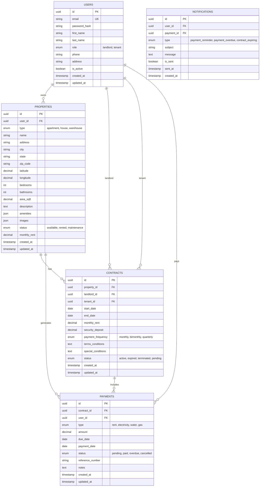

# Plan de Desarrollo - RentalBiz

## Sistema de Gestión Integral de Propiedades en Renta

**Versión:** 1.0.0  
**Fecha:** 2026-02-02  
**Desarrollador:** RentalBiz Team

---

## 1. Arquitectura del Sistema

### 1.1 Visión General

```
┌─────────────────────────────────────────────────────────────────────────┐
│                          ARQUITECTURA RENTALBIZ                         │
├─────────────────────────────────────────────────────────────────────────┤
│                                                                         │
│  ┌──────────────┐     ┌──────────────┐     ┌──────────────┐            │
│  │   Frontend   │◄────┤    Backend    │◄────┤   Base de    │            │
│  │   React.js   │     │  Node.js +    │     │    Datos     │            │
│  │              │     │   Express     │     │  MySQL 8.0   │            │
│  └──────────────┘     └──────────────┘     └──────────────┘            │
│         │                    │                    │                     │
│         │                    │                    │                     │
│         │                    ▼                    │                     │
│         │           ┌──────────────┐              │                     │
│         │           │  Servidor    │              │                     │
│         │           │  Email SMTP  │──────────────┘                     │
│         │           └──────────────┘                                    │
│         │                                                            │
│         ▼                                                            │
│  ┌─────────────────────────────────────────────────────┐              │
│  │              Cliente (Browser/Móvil)                │              │
│  └─────────────────────────────────────────────────────┘              │
│                                                                         │
└─────────────────────────────────────────────────────────────────────────┘
```

### 1.2 Stack Tecnológico

| Componente | Tecnología | Versión |
|------------|------------|---------|
| **Backend** | Node.js | 18.x LTS |
| **Framework** | Express.js | 4.18.x |
| **Base de Datos** | MySQL | 8.0.x |
| **ORM** | Sequelize | 6.x |
| **Frontend** | React.js | 18.x |
| **Gestor Paquetes** | npm/yarn | Latest |
| **Autenticación** | JWT + bcrypt | - |
| **Email** | Nodemailer | 6.x |

### 1.3 Estructura del Proyecto

```
RentalBiz/
├── .env.local              # Variables de entorno locales
├── .env.production         # Variables de entorno producción
├── package.json            # Dependencias del proyecto raíz
├── server.js               # Punto de entrada backend
├── README.md               # Documentación principal
├── docker-compose.yml      # Configuración Docker (opcional)
│
├── backend/                # Backend Node.js
│   ├── config/
│   │   ├── config.json     # Configuración Sequelize
│   │   └── database.js     # Conexión a BD
│   ├── models/
│   │   ├── index.js        # Modelos indexados
│   │   ├── User.js         # Modelo Usuarios
│   │   ├── Property.js     # Modelo Propiedades
│   │   ├── Contract.js     # Modelo Contratos
│   │   ├── Payment.js      # Modelo Pagos
│   │   └── Notification.js # Modelo Notificaciones
│   ├── controllers/        # Controladores de API
│   │   ├── authController.js
│   │   ├── propertyController.js
│   │   ├── contractController.js
│   │   ├── paymentController.js
│   │   └── notificationController.js
│   ├── routes/             # Rutas de API
│   │   ├── authRoutes.js
│   │   ├── propertyRoutes.js
│   │   ├── contractRoutes.js
│   │   ├── paymentRoutes.js
│   │   └── notificationRoutes.js
│   ├── middleware/
│   │   ├── auth.js         # Middleware JWT
│   │   ├── validation.js   # Validación datos
│   │   └── errorHandler.js # Manejo errores
│   ├── services/           # Lógica de negocio
│   │   ├── emailService.js
│   │   └── paymentService.js
│   ├── migrations/         # Migraciones Sequelize
│   ├── seeders/            # Datos de prueba
│   ├── utils/
│   │   ├── helpers.js
│   │   └── constants.js
│   └── tests/              # Pruebas unitarias
│
├── frontend/               # Frontend React.js
│   ├── public/
│   │   └── index.html
│   ├── src/
│   │   ├── components/     # Componentes reutilizables
│   │   │   ├── Layout/
│   │   │   ├── Forms/
│   │   │   ├── Tables/
│   │   │   └── Cards/
│   │   ├── pages/          # Páginas principales
│   │   │   ├── Dashboard/
│   │   │   ├── Properties/
│   │   │   ├── Contracts/
│   │   │   ├── Payments/
│   │   │   └── Settings/
│   │   ├── context/        # Context API
│   │   │   ├── AuthContext.js
│   │   │   └── AppContext.js
│   │   ├── hooks/          # Custom hooks
│   │   ├── services/       # API calls
│   │   │   └── api.js
│   │   ├── utils/          # Utilidades
│   │   ├── styles/         # Estilos CSS/SASS
│   │   └── App.js          # Componente principal
│   ├── package.json
│   └── .env                # Variables frontend
│
├── scripts/                # Scripts de utilidad
│   ├── setup.sh            # Configuración inicial
│   ├── deploy.bat          # Despliegue Windows
│   ├── migrate.bat         # Migrar BD
│   └── seed.bat            # Poblar BD
│
└── docs/                   # Documentación
    ├── API.md              # Documentación API
    ├── USER_MANUAL.md      # Manual de usuario
    └── DEPLOYMENT.md       # Guía despliegue
```

---

## 2. Modelos de Base de Datos

### 2.1 Diagrama Entidad-Relación



### 2.2 Detalle de Tablas

#### 2.2.1 Tabla: `users`
| Campo | Tipo | Restricciones | Descripción |
|-------|------|---------------|-------------|
| `id` | UUID | PK, AUTO | Identificador único |
| `email` | VARCHAR(255) | UNIQUE, NOT NULL | Email del usuario |
| `password_hash` | VARCHAR(255) | NOT NULL | Hash de contraseña |
| `first_name` | VARCHAR(100) | NOT NULL | Nombre |
| `last_name` | VARCHAR(100) | NOT NULL | Apellido |
| `role` | ENUM | NOT NULL | landlord, tenant |
| `phone` | VARCHAR(20) | NULL | Teléfono |
| `address` | TEXT | NULL | Dirección |
| `is_active` | BOOLEAN | DEFAULT TRUE | Estado |
| `created_at` | TIMESTAMP | DEFAULT NOW() | Creación |
| `updated_at` | TIMESTAMP | AUTO UPDATE | Actualización |

#### 2.2.2 Tabla: `properties`
| Campo | Tipo | Restricciones | Descripción |
|-------|------|---------------|-------------|
| `id` | UUID | PK, AUTO | Identificador único |
| `user_id` | UUID | FK, NOT NULL | Propietario |
| `type` | ENUM | NOT NULL | apartment, house, warehouse |
| `name` | VARCHAR(200) | NOT NULL | Nombre |
| `address` | VARCHAR(500) | NOT NULL | Dirección |
| `city` | VARCHAR(100) | NOT NULL | Ciudad |
| `state` | VARCHAR(100) | NOT NULL | Estado |
| `zip_code` | VARCHAR(20) | NULL | Código postal |
| `bedrooms` | INT | NULL | Habitaciones |
| `bathrooms` | DECIMAL | NULL | Baños |
| `area_sqft` | DECIMAL | NULL | Área en pies² |
| `description` | TEXT | NULL | Descripción |
| `amenities` | JSON | NULL | Comodidades |
| `images` | JSON | NULL | Fotografías |
| `status` | ENUM | DEFAULT available | Estado |
| `monthly_rent` | DECIMAL(10,2) | NOT NULL | Renta mensual |

#### 2.2.3 Tabla: `contracts`
| Campo | Tipo | Restricciones | Descripción |
|-------|------|---------------|-------------|
| `id` | UUID | PK, AUTO | Identificador único |
| `property_id` | UUID | FK, NOT NULL | Propiedad |
| `landlord_id` | UUID | FK, NOT NULL | Arrendador |
| `tenant_id` | UUID | FK, NOT NULL | Arrendatario |
| `start_date` | DATE | NOT NULL | Fecha inicio |
| `end_date` | DATE | NOT NULL | Fecha fin |
| `monthly_rent` | DECIMAL(10,2) | NOT NULL | Renta mensual |
| `security_deposit` | DECIMAL(10,2) | NULL | Depósito |
| `payment_frequency` | ENUM | DEFAULT monthly | Frecuencia |
| `terms_conditions` | TEXT | NULL | Términos |
| `special_conditions` | TEXT | NULL | Condiciones |
| `status` | ENUM | DEFAULT pending | Estado |

#### 2.2.4 Tabla: `payments`
| Campo | Tipo | Restricciones | Descripción |
|-------|------|---------------|-------------|
| `id` | UUID | PK, AUTO | Identificador único |
| `contract_id` | UUID | FK, NOT NULL | Contrato |
| `user_id` | UUID | FK, NOT NULL | Usuario |
| `type` | ENUM | NOT NULL | rent, electricity, water, gas |
| `amount` | DECIMAL(10,2) | NOT NULL | Monto |
| `due_date` | DATE | NOT NULL | Fecha vencimiento |
| `payment_date` | DATE | NULL | Fecha pago |
| `status` | ENUM | DEFAULT pending | Estado |
| `reference_number` | VARCHAR(100) | NULL | Referencia |

#### 2.2.5 Tabla: `notifications`
| Campo | Tipo | Restricciones | Descripción |
|-------|------|---------------|-------------|
| `id` | UUID | PK, AUTO | Identificador único |
| `user_id` | UUID | FK, NOT NULL | Usuario |
| `payment_id` | UUID | FK, NULL | Pago relacionado |
| `type` | ENUM | NOT NULL | Tipo |
| `subject` | VARCHAR(255) | NOT NULL | Asunto |
| `message` | TEXT | NOT NULL | Mensaje |
| `is_sent` | BOOLEAN | DEFAULT FALSE | Enviado |
| `sent_at` | TIMESTAMP | NULL | Fecha envío |

---

## 3. API RESTful

### 3.1 Autenticación

#### POST `/api/auth/register`
Registra un nuevo usuario.

**Request:**
```json
{
  "email": "user@example.com",
  "password": "securePassword123",
  "first_name": "John",
  "last_name": "Doe",
  "role": "landlord",
  "phone": "+1234567890"
}
```

**Response (201):**
```json
{
  "success": true,
  "message": "User registered successfully",
  "data": {
    "user": { ... },
    "token": "jwt_token_here"
  }
}
```

#### POST `/api/auth/login`
Autentica usuario y retorna JWT token.

**Request:**
```json
{
  "email": "user@example.com",
  "password": "securePassword123"
}
```

**Response (200):**
```json
{
  "success": true,
  "data": {
    "user": { ... },
    "token": "jwt_token_here"
  }
}
```

#### GET `/api/auth/profile`
Obtiene perfil del usuario autenticado.

**Headers:** `Authorization: Bearer <token>`

### 3.2 Propiedades

| Método | Endpoint | Descripción |
|--------|----------|-------------|
| GET | `/api/properties` | Lista propiedades |
| GET | `/api/properties/:id` | Detalle propiedad |
| POST | `/api/properties` | Crea propiedad |
| PUT | `/api/properties/:id` | Actualiza propiedad |
| DELETE | `/api/properties/:id` | Elimina propiedad |
| GET | `/api/properties/:id/contracts` | Contratos de propiedad |
| GET | `/api/properties/:id/payments` | Pagos de propiedad |

### 3.3 Contratos

| Método | Endpoint | Descripción |
|--------|----------|-------------|
| GET | `/api/contracts` | Lista contratos |
| GET | `/api/contracts/:id` | Detalle contrato |
| POST | `/api/contracts` | Crea contrato |
| PUT | `/api/contracts/:id` | Actualiza contrato |
| PUT | `/api/contracts/:id/status` | Cambia estado |
| GET | `/api/contracts/:id/payments` | Pagos del contrato |

### 3.4 Pagos

| Método | Endpoint | Descripción |
|--------|----------|-------------|
| GET | `/api/payments` | Lista pagos |
| GET | `/api/payments/:id` | Detalle pago |
| POST | `/api/payments` | Registra pago |
| PUT | `/api/payments/:id` | Actualiza pago |
| GET | `/api/payments/pending` | Pagos pendientes |
| GET | `/api/payments/overdue` | Pagos vencidos |
| GET | `/api/payments/summary` | Resumen pagos |

### 3.5 Notificaciones

| Método | Endpoint | Descripción |
|--------|----------|-------------|
| GET | `/api/notifications` | Lista notificaciones |
| PUT | `/api/notifications/:id/read` | Marcar leída |
| POST | `/api/notifications/send-reminders` | Enviar recordatorios |
| GET | `/api/notifications/settings` | Preferencias |

---

## 4. Frontend React.js

### 4.1 Estructura de Componentes

```
src/
├── components/
│   ├── Layout/
│   │   ├── Header.jsx
│   │   ├── Sidebar.jsx
│   │   ├── Footer.jsx
│   │   └── Layout.jsx
│   ├── Forms/
│   │   ├── PropertyForm.jsx
│   │   ├── ContractForm.jsx
│   │   ├── PaymentForm.jsx
│   │   └── UserForm.jsx
│   ├── Tables/
│   │   ├── PropertiesTable.jsx
│   │   ├── ContractsTable.jsx
│   │   └── PaymentsTable.jsx
│   ├── Cards/
│   │   ├── PropertyCard.jsx
│   │   ├── ContractCard.jsx
│   │   └── PaymentCard.jsx
│   └── UI/
│       ├── Button.jsx
│       ├── Input.jsx
│       ├── Select.jsx
│       ├── Modal.jsx
│       └── Alert.jsx
```

### 4.2 Páginas

```
src/pages/
├── Dashboard/
│   └── Dashboard.jsx
├── Auth/
│   ├── Login.jsx
│   └── Register.jsx
├── Properties/
│   ├── PropertiesList.jsx
│   ├── PropertyDetail.jsx
│   └── PropertyForm.jsx
├── Contracts/
│   ├── ContractsList.jsx
│   ├── ContractDetail.jsx
│   └── ContractForm.jsx
├── Payments/
│   ├── PaymentsList.jsx
│   ├── PaymentDetail.jsx
│   ├── PaymentForm.jsx
│   └── Reports.jsx
├── Settings/
│   ├── Profile.jsx
│   ├── Notifications.jsx
│   └── Users.jsx
└── NotFound.jsx
```

### 4.3 Context API

```javascript
// AuthContext.js - Estado global de autenticación
{
  user: null,
  isAuthenticated: false,
  token: null,
  login: () => {},
  logout: () => {},
  updateProfile: () => {}
}

// AppContext.js - Estado global de la aplicación
{
  properties: [],
  contracts: [],
  payments: [],
  notifications: [],
  loading: false,
  error: null,
  fetchProperties: () => {},
  // ...
}
```

---

## 5. Sistema de Notificaciones

### 5.1 Tipos de Notificaciones

| Tipo | Descripción | Anticipación |
|------|-------------|--------------|
| `payment_reminder` | Recordatorio de pago | 5-7 días antes |
| `payment_overdue` | Pago vencido | Inmediato |
| `contract_expiring` | Contrato por vencer | 30 días antes |
| `contract_renewal` | Renovación de contrato | 15 días antes |

### 5.2 Plantillas de Email

#### Recordatorio de Pago de Renta
```
Subject: Recordatorio: Pago de renta - {{property_name}}

Hola {{user_name}},

Te recordamos que el pago de renta de {{property_address}} 
vence el {{due_date}}.

Monto a pagar: ${{amount}}
Referencia: {{reference}}

Instrucciones de pago:
[INSTRUCCIONES]

Saludos,
RentalBiz
```

#### Pago Vencido
```
Subject: URGENTE: Pago vencido - {{property_name}}

Hola {{user_name}},

Tu pago de {{payment_type}} de {{property_address}} 
ha vencido el {{due_date}}.

Monto vencido: ${{amount}}
Días de atraso: {{days_overdue}}

Por favor realiza el pago lo antes posible para evitar 
complicaciones.

Saludos,
RentalBiz
```

---

## 6. Configuración de Entornos

### 6.1 Variables de Entorno Locales (.env.local)

```env
# Servidor
PORT=3000
NODE_ENV=development

# Base de Datos Local
DB_HOST=localhost
DB_PORT=3306
DB_NAME=rentalbiz
DB_USER=root
DB_PASSWORD=your_local_password

# JWT
JWT_SECRET=your_super_secret_jwt_key_dev
JWT_EXPIRES_IN=7d

# Email (Development)
SMTP_HOST=smtp.ethereal.email
SMTP_PORT=587
SMTP_USER=your_ethereal_user
SMTP_PASS=your_ethereal_pass
EMAIL_FROM=noreply@localhost

# Frontend URL
FRONTEND_URL=http://localhost:5173
```

### 6.2 Variables de Producción (.env.production)

```env
# Servidor
PORT=3000
NODE_ENV=production

# Base de Datos Produccón
DB_HOST=your_production_db_host
DB_PORT=3306
DB_NAME=rentalbiz_prod
DB_USER=rentalbiz_user
DB_PASSWORD=your_strong_production_password

# JWT
JWT_SECRET=your_production_jwt_secret_must_be_long
JWT_EXPIRES_IN=24h

# Email (Production)
SMTP_HOST=smtp.your_provider.com
SMTP_PORT=465
SMTP_USER=your_smtp_user
SMTP_PASS=your_smtp_password
EMAIL_FROM=alerts@yourdomain.com

# Frontend URL
FRONTEND_URL=https://your-production-domain.com
```

---

## 7. Despliegue en Windows

### 7.1 Preparación del Servidor

```batch
@echo off
REM Script de preparación del servidor Windows
REM rentalbiz/scripts/prepare_server.bat

echo ============================================
echo   Preparando servidor para RentalBiz...
echo ============================================

REM Verificar Node.js
node --version
if errorlevel 1 (
    echo Node.js no encontrado. Por favor instalar Node.js 18.x LTS
    pause
    exit /b 1
)

REM Verificar MySQL
mysql --version
if errorlevel 1 (
    echo MySQL no encontrado. Por favor instalar MySQL 8.0
    pause
    exit /b 1
)

echo Servidor preparado correctamente.
pause
```

### 7.2 Script de Despliegue

```batch
@echo off
REM Script de despliegue en producción
REM rentalbiz/scripts/deploy.bat

setlocal

echo ============================================
echo   Desplegando RentalBiz en producción...
echo ============================================

REM Configurar directorio
set APP_DIR=%~dp0..
set BACKEND_DIR=%APP_DIR%\backend
set FRONTEND_DIR=%APP_DIR%\frontend

REM Instalar dependencias backend
echo Instalando dependencias del backend...
cd %BACKEND_DIR%
call npm install --production

REM Ejecutar migraciones
echo Ejecutando migraciones de base de datos...
call npx sequelize-cli db:migrate

REM Compilar frontend
echo Compilando frontend...
cd %FRONTEND_DIR%
call npm install
call npm run build

REM Copiar build al backend
xcopy /E /I "%FRONTEND_DIR%\dist" "%BACKEND_DIR%\public"

REM Reiniciar servicio
echo Reiniciando servicio...
call net stop rentalbiz 2>nul
call net start rentalbiz

echo ============================================
echo   Despliegue completado exitosamente!
echo ============================================
endlocal
pause
```

### 7.3 Servicio Windows

Crear archivo `rentalbiz-service.js` para ejecutar como servicio:

```javascript
const { exec } = require('child_process');
const { Service } = require('node-windows').Service;

const svc = new Service({
  name: 'RentalBiz',
  description: 'Sistema de Gestión de Propiedades en Renta',
  script: 'C:\\rentalbiz\\backend\\server.js',
  nodeOptions: [
    '--harmony',
    '--max_old_space_size=4096'
  ],
  env: [
    {
      name: "NODE_ENV",
      value: "production"
    }
  ]
});

svc.on('install', function() {
  svc.start();
  console.log('Servicio instalado correctamente');
});

svc.install();
```

---

## 8. Pruebas

### 8.1 Pruebas Unitarias (Backend)

```javascript
// backend/tests/users.test.js
const { describe, it, before, after } = require('chai');
const request = require('supertest');
const app = require('../app');

describe('Users API', () => {
  describe('POST /api/auth/register', () => {
    it('should register a new user', async () => {
      const res = await request(app)
        .post('/api/auth/register')
        .send({
          email: 'test@example.com',
          password: 'test123',
          first_name: 'Test',
          last_name: 'User',
          role: 'landlord'
        });
      
      expect(res.status).to.equal(201);
      expect(res.body.success).to.be.true;
    });
  });
});
```

### 8.2 Pruebas de Integración

```javascript
// backend/tests/integration.test.js
describe('Payment Flow', () => {
  it('should create contract and generate payments', async () => {
    // 1. Crear propiedad
    // 2. Crear contrato
    // 3. Verificar que se generaron pagos
    // 4. Registrar pago
    // 5. Verificar estado del pago
  });
});
```

---

## 9. Documentación

### 9.1 Estructura de Documentación

```
docs/
├── API.md              # Documentación completa de endpoints
├── USER_MANUAL.md      # Manual para usuarios finales
├── DEPLOYMENT.md       # Guía de despliegue detallada
├── ARCHITECTURE.md     # Documentación técnica
└── CHANGELOG.md        # Historial de cambios
```

---

## 10. Siguientes Pasos

1. [ ] Configurar estructura base del proyecto
2. [ ] Crear configuración de variables de entorno
3. [ ] Implementar backend con Express.js y Sequelize
4. [ ] Crear modelos de base de datos
5. [ ] Implementar sistema de autenticación JWT
6. [ ] Crear API RESTful completa
7. [ ] Implementar módulo de propiedades
8. [ ] Implementar módulo de contratos
9. [ ] Implementar módulo de pagos
10. [ ] Implementar sistema de notificaciones por email
11. [ ] Configurar frontend con React.js
12. [ ] Crear componentes y páginas principales
13. [ ] Implementar gestión de estado global
14. [ ] Crear dashboard y reportes
15. [ ] Configurar sistema de despliegue en Windows
16. [ ] Escribir pruebas unitarias
17. [ ] Crear documentación técnica
18. [ ] Crear manual de usuario
19. [ ] Configurar scripts de despliegue automatizado
20. [ ] Realizar pruebas de integración
21. [ ] Documentar API con Swagger

---

**¿Estás conforme con este plan? ¿Deseas que realice alguna modificación o adición antes de comenzar con la implementación?**
